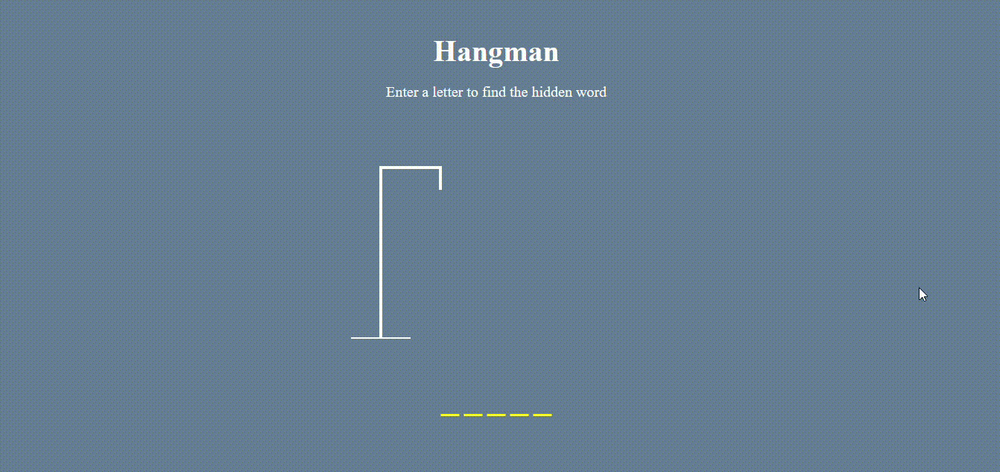

# Hangman-Game

This is a simple Hangman game built with HTML, CSS, and JavaScript.

## How to Play

- The game selects a random word from an external API using `getRandomWordFromAPI` function.
- You need to guess the word by entering letters.
- Correctly guessed letters will be displayed in the word, and incorrect letters will be shown in the "Wrong Letters" section.
- You can only make a certain number of wrong guesses before losing the game.
- If you guess the word correctly, you win! If you make too many wrong guesses, you lose.


## How to Run Locally

1. Clone the repository:

   ```bash
   git clone https://github.com/your-username/hangman-game.git
   ```

2. Open the `index.html` file in your preferred web browser.

3. Start playing the Hangman game!

## Features

- Dynamic word selection from an external API.
- Visual representation of correct and wrong letters.
- Responsive design for a seamless experience on various devices.

## Dependencies

- No external dependencies. Purely built with HTML, CSS, and JavaScript.

## Demo

